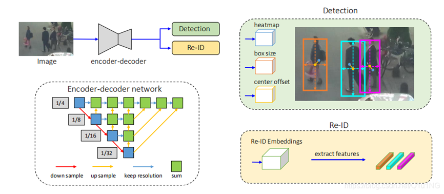

# FairMOT-mindspore-jupyter
The mindspore version FairMOT with jupyter notebook.

[中文](README.zh.md)

## Files

1. src, contains code to import and self-supervised pretraining model.
2. fairMOT.ipynb. The whole process for training and testing, the output will be saved to directory.

## Model introduce
FairMOT is a target detection framework proposed by Huazhong University of Science and Technology and Microsoft Research Asia. All FairMOT improvements to previous methods come from the following three viewpoints:
1. Anchors are not friendly to Re-ID, and the anchor-free algorithm should be used.

2. Multi-layer feature fusion should be performed.

3. For the one-shot method, it is better to use a low dimension for the feature vector of Re-ID.

On MOT15, MOT16, MOT17, MOT20 and other datasets, the frame number of 30fps has reached the current SOTA level.
Most of the existing SOTA methods use a two-step approach:
1. The target is detected by the target detection algorithm.

2. The features are obtained through the Re-ID model, and the ID is obtained by comparison.

Although with the development of target detection algorithm and Re-ID in recent years, the two-step method also has obvious performance improvement in target tracking, but the two-step method does not share the feature map of the detection algorithm and Re-ID, so its speed Very slow and difficult to infer at video rates.
With the maturity of the two-step approach, more researchers have begun to study the one-shot algorithm that detects objects and learns Re-ID features at the same time. When the feature map is shared between object detection and Re-ID, it can be greatly reduced. Inference time, but the accuracy will be much lower than the two-step method. Therefore, the author analyzes the one-shot method and improves the general segmentation model process to obtain the following model framework:

The framework is mainly composed of an encoder-decoder network, and the extracted data is used by the latter two networks, so that the network characteristics of detection and Re-ID are common, which can improve efficiency and better effect (compared to other two-step approach)
In the detection network, the three results of heatmap, box size, and center offset can be obtained in turn from the three heads, which are used to use and calculate the loss. For the specific loss calculation formula, please refer to the original paper.

## Method implementation

FairMOT itself does not emphasize the type of model neural network, as long as the encoder-decoder type is satisfied. Here we use HR-Net (the previous paper of the same institution) as the specific model used.

### data set
Since there are many datasets used by FairMOT, the specific file structure refers to the [Dataset] (https://github.com/Zhongdao/Towards-Realtime-MOT/blob/master/DATASET_ZOO.md).
In the implementation using MindSpore, unlike pytorch, we do not need to inherit the parent class in Mindspore. The implemented dataset class only needs to implement the three functions of init, get_item, and len.
The dataset needs to be passed to GeneratorDataset in mindspore.dataset to use.

### Neural network model

The implementation of the network model needs to inherit mindspore.nn.
However, FairMOT requires a very long training time. If you just learn this process, you can directly load the pre-trained model. In addition, the model requires self-supervised pre-training. It is recommended to load directly here. We do not provide pre-training code. You can also download the pytorch file in the original text for conversion. You can use src/utils/pth2ckpt for conversion. [file](src/utils/crowdhuman_dla34_ms.ckpt)

### Loss function

The loss function needs to inherit mindspore.nn.Cell

Jupyter uses the existing loss implementation on the Internet.
