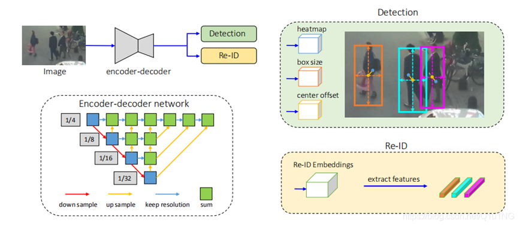

# FairMOT-mindspore-jupyter
mindspore实现的fairmot, jupyter版本。

## 文件说明

1. src，需要引用的代码和工具以及预训练模型（自监督预训练模型，不是最终的模型）
2. fairMOT.ipynb，训练，测试流程代码，输出会保存到文件夹。

## 方法介绍
FairMOT是华中科技大学和微软亚洲研究院提出的一个目标检测的框架，FairMOT的所有对以前方法的改进都来自于以下三个观点：
1. anchors对于Re-ID并不友好，应该采用anchor-free算法。

2. 应该进行多层特征的融合。

3. 对于one-shot方法，Re-ID的特征向量采用低维度更好。

在MOT15、MOT16、MOT17、MOT20等数据集上以30fps的帧数达到了目前的SOTA水平。
现存的SOTA方法当中大部分都是采用两步走的方法：
1. 通过目标检测算法检测到目标。

2. 再经过Re-ID模型得到特征，比对得到ID。

尽管随着近年来目标检测算法与Re-ID的发展，two-step方法在目标跟踪上也有明显的性能提升，但是两步走方法不会共享检测算法与Re-ID的特征图，所以其速度很慢，很难在视频速率下进行推理。
随着两步走方法的成熟，更多的研究人员开始研究同时检测目标和学习Re-ID特征的one-shot算法，当特征图在目标检测与Re-ID之间共享之后，可以大大的减少推理时间，但在精度上就会比两步走方法低很多。所以作者针对one-shot方法进行分析，改进了一般的分割模型流程得到了以下模型框架：

该框架主要由一个encoder-decoder网络构成，其提取的数据供后两个网络使用，以此做到检测和Re-ID的网络特征共通，既能提高效率又有更好的效果（相较于其他两步走方法）
在检测网络中，由三个头可以依次得到heatmap, box大小，和中心偏移三个结果，用于使用和计算loss，具体loss计算公式可以参考原论文。

## 方法实现

FairMOT本身并不强调模型神经网络类型，只要满足encoder-decoder类型就行了，在这里我们使用HR-Net（同机构之前的论文）作为具体使用的模型。

### 数据集
由于FairMOT使用的数据集很多，具体文件结构参照这里放置[数据集](https://github.com/Zhongdao/Towards-Realtime-MOT/blob/master/DATASET_ZOO.md)。
在使用MindSpore实现中，和pytorch不同，我们不需要继承Mindspore中的父类，实现的数据集类只需实现init, get_item, len三个函数就可以了。
数据集需要传递给mindspore.dataset中的GeneratorDataset来使用。

### 神经网络模型

网络模型的实现需要继承mindspore.nn来实现。
不过FairMOT需要的训练时间很长很长，如果只是学习这个过程可以直接载入预训练模型。另外模型需要自监督的预训练，这里建议直接载入，我们没有提供预训练的代码。您也可以下载原文中pytorch文件进行转换，转换可以使用src/utils/pth2ckpt。[文件](src/utils/crowdhuman_dla34_ms.ckpt)

### 损失函数

损失函数需要继承mindspore.nn.Cell

jupyter中使用了网上现有的loss实现方式。

